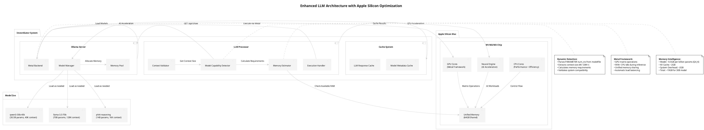

# Contributing to InvestiGator

🐊 **Welcome to InvestiGator!** We're excited to have you contribute to the premier open-source AI investment research platform.

## 📋 Table of Contents

- [Quick Start for Contributors](#-quick-start-for-contributors)
- [Development Environment Setup](#-development-environment-setup)
- [Project Architecture](#-project-architecture)
- [Contribution Guidelines](#-contribution-guidelines)
- [Code Standards](#-code-standards)
- [Testing Requirements](#-testing-requirements)
- [Documentation Standards](#-documentation-standards)
- [Pull Request Process](#-pull-request-process)
- [High-Priority Areas](#-high-priority-contribution-areas)
- [Getting Help](#-getting-help)

## 🚀 Quick Start for Contributors

### Prerequisites
- **macOS 12.0+** with Apple Silicon (M1/M2/M3)
- **64GB+ RAM** recommended for development
- **Python 3.9+**
- **PostgreSQL 14+**
- **Git** and **GitHub account**

### Fork and Setup

```bash
# Fork the repository on GitHub, then:
git clone https://github.com/YOUR_USERNAME/InvestiGator.git
cd InvestiGator

# Create a feature branch
git checkout -b feature/your-awesome-feature

# Set up development environment
python3 -m venv venv
source venv/bin/activate
pip install -r requirements.txt

# Configure the system
cp config.json.sample config.json
# Edit config.json with your SEC user agent: "YourName/1.0 (your-email@example.com)"

# Set up the database
createdb investment_ai
psql -d investment_ai -f schema/consolidated_schema.sql

# Install Ollama and pull a model
curl -fsSL https://ollama.com/install.sh | sh
ollama pull llama3.1:8b-instruct-q8_0

# Test your setup
./investigator.sh --test-system

# Run the test suite
./investigator.sh --run-tests all
```

## 🏗️ Development Environment Setup

### Required Tools

```bash
# Install system dependencies
brew install postgresql@14 python@3.9 git curl wget plantuml

# Install Python development tools
pip install -r requirements.txt
pip install pytest pytest-cov black isort mypy

# Install documentation tools
npm install -g @mermaid-js/mermaid-cli  # For Mermaid diagrams
```

### IDE Configuration

**VS Code (Recommended):**
```json
{
  "python.defaultInterpreterPath": "./venv/bin/python",
  "python.linting.enabled": true,
  "python.linting.pylintEnabled": true,
  "python.formatting.provider": "black",
  "python.sortImports.args": ["--profile", "black"]
}
```

**PyCharm:**
- Set Python interpreter to `./venv/bin/python`
- Enable Black formatting
- Configure pytest as test runner

## 🏛️ Project Architecture

InvestiGator uses a **pattern-based architecture** with clear separation of concerns:

### Core Patterns
- **Facade Pattern**: Simplified interfaces (`sec_facade.py`, `llm_facade.py`)
- **Strategy Pattern**: Pluggable algorithms (`sec_strategies.py`, `llm_strategies.py`)
- **Observer Pattern**: Event-driven processing (`llm_interfaces.py`)
- **Template Method**: Standardized workflows (`llm_processors.py`)

### Key Components

```
patterns/                    # Pattern-based architecture
├── core/                   # Base interfaces and abstractions
├── llm/                    # LLM processing patterns
│   ├── llm_facade.py      # Main LLM interface
│   ├── llm_strategies.py  # Analysis strategies
│   ├── llm_processors.py  # Queue-based processing
│   └── llm_model_config.py # Model capability management
├── sec/                    # SEC data processing patterns
│   ├── sec_facade.py      # SEC analysis interface
│   ├── sec_strategies.py  # Data fetching strategies
│   └── sec_adapters.py    # Data transformation
└── analysis/              # Advanced analysis patterns
    └── peer_comparison.py # Peer group analysis

utils/                      # Utility modules
├── cache/                 # Multi-backend cache system
├── api_client.py         # HTTP client utilities
├── db.py                 # Database management
└── financial_data_aggregator.py # Financial data processing
```

### Data Flow Architecture



## 📝 Contribution Guidelines

### Types of Contributions

1. **🐛 Bug Fixes**: Fix issues, improve error handling
2. **✨ New Features**: Add functionality, new analysis types
3. **📚 Documentation**: Improve docs, add examples
4. **🔧 Performance**: Optimize cache, improve speed
5. **🧪 Testing**: Add test coverage, improve reliability
6. **🎨 UI/UX**: Improve CLI, add web interface

### Before You Start

1. **Check existing issues** on GitHub
2. **Create an issue** for major features
3. **Discuss architecture** changes in issues
4. **Follow coding standards** (see below)

### Development Workflow

```bash
# 1. Create feature branch
git checkout -b feature/descriptive-name

# 2. Make changes with tests
# ... write code ...
# ... write tests ...

# 3. Run quality checks
black .                    # Format code
isort .                   # Sort imports
mypy patterns/ utils/     # Type checking
pytest tests/             # Run tests

# 4. Update documentation
# ... update relevant .adoc files ...
# ... generate new diagrams if needed ...

# 5. Commit with clear messages
git add .
git commit -m "feat: add dynamic context validation for LLM models

- Implement ModelCapabilityDetector for automatic context size detection
- Add MemoryEstimator for system resource validation  
- Enhance ContextValidator with prompt size calculation
- Update documentation with new Metal framework integration

Fixes #123"

# 6. Push and create PR
git push origin feature/descriptive-name
```

## 📐 Code Standards

### Python Style Guide

**Follow PEP 8 with these specifics:**

```python
# Imports: Standard → Third-party → Local
import logging
import json
from typing import Dict, List, Optional

import pandas as pd
import requests

from utils.cache.cache_manager import get_cache_manager
from patterns.core.interfaces import IDataProcessor

# Class naming: PascalCase
class ModelCapabilityDetector:
    """Detects and caches LLM model capabilities from Ollama API."""
    
    def __init__(self, config: Config) -> None:
        self.config = config
        self.logger = logging.getLogger(f"{__name__}.{self.__class__.__name__}")
    
    def get_model_capabilities(self, model_name: str) -> Dict[str, Any]:
        """
        Get model capabilities including context size and memory requirements.
        
        Args:
            model_name: Name of the Ollama model
            
        Returns:
            Dictionary containing model capabilities
            
        Raises:
            ModelNotFoundError: If model is not available
        """
        try:
            # Implementation...
            pass
        except Exception as e:
            self.logger.error(f"Failed to get capabilities for {model_name}: {e}")
            raise

# Function naming: snake_case
def calculate_memory_requirements(parameter_size: str) -> Dict[str, float]:
    """Calculate memory requirements for a given model size."""
    pass

# Constants: UPPER_SNAKE_CASE
MAX_CONTEXT_SIZE = 128000
DEFAULT_TEMPERATURE = 0.3
```

### Type Hints

**Use comprehensive type hints:**

```python
from typing import Dict, List, Optional, Union, Tuple, Any, Callable
from pathlib import Path
from datetime import datetime

# Function signatures
def process_quarterly_data(
    data: List[QuarterlyData], 
    max_periods: int = 4,
    strategy: Optional[str] = None
) -> Tuple[Dict[str, Any], List[str]]:
    """Process quarterly financial data."""
    pass

# Class attributes
class DataProcessor:
    def __init__(self) -> None:
        self.cache: Dict[str, Any] = {}
        self.processed_count: int = 0
        self.last_update: Optional[datetime] = None
```

### Error Handling

**Use structured error handling:**

```python
# Custom exceptions
class InvestiGatorError(Exception):
    """Base exception for InvestiGator."""
    pass

class ModelNotFoundError(InvestiGatorError):
    """Raised when LLM model is not available."""
    pass

class CacheError(InvestiGatorError):
    """Raised when cache operations fail."""
    pass

# Error handling pattern
def risky_operation(symbol: str) -> Dict[str, Any]:
    """Perform operation that might fail."""
    try:
        result = expensive_computation(symbol)
        return result
    except SpecificError as e:
        logger.warning(f"Specific issue with {symbol}: {e}")
        return create_fallback_result(symbol)
    except Exception as e:
        logger.error(f"Unexpected error processing {symbol}: {e}")
        raise InvestiGatorError(f"Failed to process {symbol}") from e
```

### Logging Standards

```python
import logging

# Logger creation
logger = logging.getLogger(__name__)

# Logging levels and formats
logger.debug("🔍 Debug info: variable_value=%s", value)
logger.info("✅ Operation completed successfully for %s", symbol)
logger.warning("⚠️ Warning: %s exceeded threshold", metric)
logger.error("❌ Error processing %s: %s", symbol, error)

# Performance logging
start_time = time.time()
# ... operation ...
elapsed = time.time() - start_time
logger.info("⏱️ Operation completed in %.2fs", elapsed)
```

## 🧪 Testing Requirements

### Test Structure

```
tests/
├── conftest.py                    # Test configuration
├── fixtures/                     # Test data
├── cache/                        # Cache system tests
│   ├── test_cache_manager.py     # Core cache functionality
│   ├── test_file_cache_handler.py # File cache tests
│   └── test_rdbms_cache_handler.py # Database cache tests
├── patterns/                     # Pattern tests
│   ├── test_llm_facade.py        # LLM facade tests
│   └── test_sec_strategies.py    # SEC strategy tests
└── utils/                        # Utility tests
    └── test_financial_aggregator.py # Financial processing tests
```

### Writing Tests

**Use pytest with clear naming:**

```python
import pytest
from unittest.mock import Mock, patch
from patterns.llm.llm_processors import LLMExecutionHandler

class TestLLMExecutionHandler:
    """Test LLM execution with model capabilities."""
    
    def test_get_model_capabilities_success(self):
        """Should retrieve and cache model capabilities."""
        # Arrange
        handler = LLMExecutionHandler(config=mock_config)
        expected_caps = {
            'context_size': 40960,
            'parameter_size': '30.5B',
            'memory_sufficient': True
        }
        
        # Act
        with patch('utils.api_client.OllamaAPIClient.show_model') as mock_show:
            mock_show.return_value = {'modelfile': 'PARAMETER num_ctx 40960'}
            result = handler.get_model_capabilities('test-model')
        
        # Assert
        assert result['context_size'] == 40960
        assert result['parameter_size'] == '30.5B'
        assert result['memory_sufficient'] is True
    
    def test_context_validation_overflow_prevention(self):
        """Should adjust output tokens when prompt is too large."""
        # Test implementation...
        pass
    
    @pytest.mark.integration
    def test_end_to_end_model_execution(self):
        """Integration test for full model execution flow."""
        # Test implementation...
        pass
```

### Test Requirements

- **Unit tests**: Cover all public methods
- **Integration tests**: Test component interactions
- **Performance tests**: Validate cache and analysis speed
- **Error tests**: Test exception handling
- **Mock external APIs**: Don't hit real SEC/Ollama APIs in tests

### Running Tests

```bash
# Run all tests
pytest tests/ -v

# Run specific test file
pytest tests/cache/test_cache_manager.py -v

# Run with coverage
pytest tests/ --cov=patterns --cov=utils --cov-report=html

# Run performance tests
pytest tests/ -m performance

# Run integration tests
pytest tests/ -m integration
```

## 📖 Documentation Standards

### Documentation Types

1. **Code Documentation**: Docstrings, type hints
2. **API Documentation**: Public interface docs
3. **Architecture Documentation**: AsciiDoc files in `docs/`
4. **User Guide**: README.adoc sections
5. **Diagrams**: PlantUML and Mermaid in `diagrams/`

### Docstring Format

**Use Google-style docstrings:**

```python
def calculate_dynamic_context_size(self, request: LLMRequest) -> Dict[str, int]:
    """
    Calculate appropriate context size based on model capabilities and prompt length.
    
    This method automatically detects the model's maximum context window from the
    Ollama API and validates that the prompt will fit within the available space.
    It can automatically adjust the output token allocation to prevent truncation.
    
    Args:
        request: LLM request containing model name, prompt, and desired output size
        
    Returns:
        Dictionary containing:
            - num_ctx: Actual context size to use
            - num_predict: Adjusted output token count
            - total_tokens: Estimated total token usage
            
    Raises:
        ModelNotFoundError: If the specified model is not available
        ContextOverflowError: If prompt exceeds model's maximum context
        
    Example:
        >>> handler = LLMExecutionHandler(config)
        >>> request = LLMRequest(model="llama3.1:8b", prompt="Analyze AAPL...")
        >>> context_params = handler.calculate_dynamic_context_size(request)
        >>> print(f"Using context: {context_params['num_ctx']}")
        Using context: 8192
        
    Note:
        This method uses a rough estimation of 4 characters per token. For more
        accurate token counting, consider using a proper tokenizer.
    """
    pass
```

### AsciiDoc Guidelines

**For documentation files in `docs/`:**

```asciidoc
= Document Title
Author Name
v1.0, 2025-06-04
:doctype: book
:toc: left
:toclevels: 3
:sectanchors:
:sectlinks:
:sectnums:
:source-highlighter: highlight.js
:icons: font
:imagesdir: ../images

== Introduction

Brief overview of the topic with clear value proposition.

=== Key Features

* *Feature 1*: Description with benefits
* *Feature 2*: Description with benefits

== Technical Details

=== Architecture

image::architecture-diagram.png[Architecture Overview]

The system consists of three main components:

. **Component 1**: Handles X with Y capability
. **Component 2**: Manages Z with A feature
. **Component 3**: Processes B with C optimization

=== Code Examples

[source,python]
----
# Example usage
from patterns.llm.llm_facade import create_llm_facade

facade = create_llm_facade(config)
result = facade.analyze_symbol("AAPL")
----

=== Performance Metrics

[cols="1,1,1"]
|===
|Operation |Time |Notes

|Cache HIT |0.5-10ms |File cache
|Model Load |30-60s |First time only
|Analysis |1-2min |Per company
|===
```

### Diagram Standards

**PlantUML for Architecture:**


**Mermaid for Flows:**


## 🔄 Pull Request Process

### Before Submitting

1. **✅ Tests pass**: All tests must pass
2. **✅ Code formatted**: Black and isort applied
3. **✅ Type checking**: mypy passes without errors
4. **✅ Documentation updated**: Relevant docs updated
5. **✅ Performance tested**: No significant regressions

### PR Title Format

```
<type>(<scope>): <description>

Examples:
feat(llm): add dynamic context validation for model capabilities
fix(cache): resolve FundamentalAnalysisFacadeV2 cache_manager initialization
docs(readme): update Apple Silicon optimization documentation
perf(cache): optimize file cache handler performance
test(llm): add comprehensive model capability detection tests
```

### PR Description Template

```markdown
## 🎯 Summary

Brief description of what this PR accomplishes.

## 🔧 Changes

- [ ] **Added**: New feature X with capability Y
- [ ] **Fixed**: Issue Z in component A
- [ ] **Updated**: Documentation for feature B
- [ ] **Optimized**: Performance of operation C

## 🧪 Testing

- [ ] Unit tests added/updated
- [ ] Integration tests pass
- [ ] Manual testing completed
- [ ] Performance regression tested

## 📖 Documentation

- [ ] Code documentation updated
- [ ] README.adoc updated
- [ ] Architecture docs updated
- [ ] New diagrams added

## 🖼️ Screenshots/Diagrams

<!-- Include relevant screenshots or architecture diagrams -->

## 🔗 Related Issues

Fixes #123
Relates to #456

## 📋 Checklist

- [ ] Code follows style guidelines
- [ ] Self-review completed
- [ ] Tests added for new functionality
- [ ] Documentation updated
- [ ] No breaking changes (or properly documented)
```

### Review Process

1. **Automated Checks**: CI/CD pipeline runs tests
2. **Code Review**: Maintainer reviews code quality
3. **Documentation Review**: Docs are clear and complete
4. **Performance Review**: No regressions introduced
5. **Architecture Review**: Changes align with patterns

## 🎯 High-Priority Contribution Areas

### 🚀 Performance & Scalability

**Impact: High** | **Difficulty: Medium-Hard**

- **Parallel Processing**: Implement async analysis for multiple stocks
- **Memory Optimization**: Reduce memory footprint for large models
- **Cache Optimization**: Improve cache hit rates and performance
- **Database Optimization**: Query optimization and indexing

```python
# Example: Async processing implementation
async def analyze_multiple_symbols(symbols: List[str]) -> Dict[str, Any]:
    """Analyze multiple symbols concurrently."""
    tasks = [analyze_symbol_async(symbol) for symbol in symbols]
    results = await asyncio.gather(*tasks, return_exceptions=True)
    return dict(zip(symbols, results))
```

### 🤖 AI & Analysis Enhancement

**Impact: High** | **Difficulty: Medium**

- **New Model Support**: Add support for latest LLM models
- **Advanced Indicators**: Implement sophisticated technical indicators
- **Sentiment Analysis**: Social media and news sentiment integration
- **Predictive Modeling**: Machine learning prediction models

```python
# Example: New sentiment analysis component
class SentimentAnalyzer:
    """Analyze market sentiment from news and social media."""
    
    def analyze_news_sentiment(self, symbol: str) -> Dict[str, float]:
        """Analyze news sentiment for a given symbol."""
        pass
    
    def analyze_social_sentiment(self, symbol: str) -> Dict[str, float]:
        """Analyze social media sentiment."""
        pass
```

### 🌐 User Experience

**Impact: High** | **Difficulty: Medium**

- **Web Dashboard**: React-based web interface
- **Mobile App**: React Native mobile application
- **CLI Improvements**: Better command-line experience
- **Real-time Updates**: WebSocket-based live data

```typescript
// Example: React dashboard component
interface DashboardProps {
  symbols: string[];
}

const InvestmentDashboard: React.FC<DashboardProps> = ({ symbols }) => {
  const [analyses, setAnalyses] = useState<Analysis[]>([]);
  
  useEffect(() => {
    // Load analysis data
    loadAnalyses(symbols).then(setAnalyses);
  }, [symbols]);
  
  return (
    <div className="dashboard">
      {analyses.map(analysis => (
        <AnalysisCard key={analysis.symbol} analysis={analysis} />
      ))}
    </div>
  );
};
```

### 🧪 Testing & Quality

**Impact: Medium** | **Difficulty: Easy-Medium**

- **Test Coverage**: Expand test coverage to 95%+
- **Performance Benchmarks**: Automated performance testing
- **CI/CD Pipeline**: GitHub Actions for automated testing
- **Code Quality**: Advanced linting and static analysis

### 📊 Data Sources

**Impact: Medium** | **Difficulty: Medium-Hard**

- **Alternative Data**: Satellite imagery, credit card data
- **International Markets**: European and Asian exchanges
- **Real-time Feeds**: WebSocket connections for live data
- **Historical Data**: Extended historical analysis

## 🆘 Getting Help

### Communication Channels

- **GitHub Issues**: Bug reports and feature requests
- **GitHub Discussions**: General questions and ideas
- **Code Reviews**: Comments on pull requests
- **Documentation**: Check `docs/` directory first

### Development Questions

**Before asking for help:**

1. **Search existing issues** and discussions
2. **Check documentation** in `docs/` directory
3. **Review similar code** in the codebase
4. **Try to reproduce** the issue with minimal code

**When asking for help:**

1. **Provide context**: What are you trying to achieve?
2. **Show code**: Include relevant code snippets
3. **Describe expected vs actual**: What should happen vs what happens?
4. **Include error messages**: Full stack traces when applicable
5. **Environment details**: macOS version, Python version, RAM, etc.

### Mentorship

**Looking for a mentor?** Tag experienced contributors:

- **@vjsingh1984**: Architecture and AI integration
- **Core contributors**: Check recent commit history

**Want to mentor?** Help new contributors by:

- Reviewing pull requests
- Answering questions in issues
- Improving documentation
- Writing tutorials

## 🎉 Recognition

### Contributor Levels

- **🌱 First-time Contributor**: First merged PR
- **🌿 Regular Contributor**: 5+ merged PRs
- **🌳 Core Contributor**: 20+ merged PRs + significant features
- **🏆 Maintainer**: Trusted with repository access

### Hall of Fame

Outstanding contributors will be recognized in:

- **README.adoc**: Contributors section
- **Release Notes**: Feature credits
- **Blog Posts**: Contributor spotlights
- **Conference Talks**: Community recognition

---

## 📄 License

By contributing to InvestiGator, you agree that your contributions will be licensed under the same [Apache License 2.0](LICENSE) that covers the project.

---

**🐊 Thank you for contributing to InvestiGator!**

*Built with ❤️ by investors, for investors*

*🔒 Privacy-First • 🏠 Runs Locally • 🤖 AI-Powered • 📊 Professional Reports*