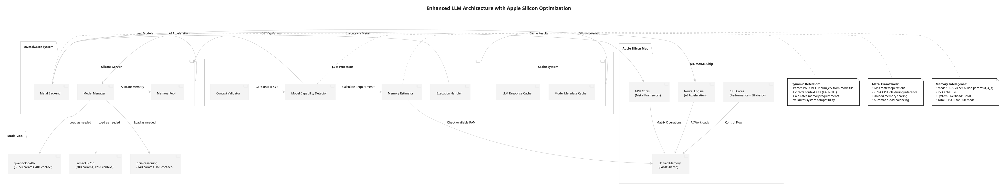
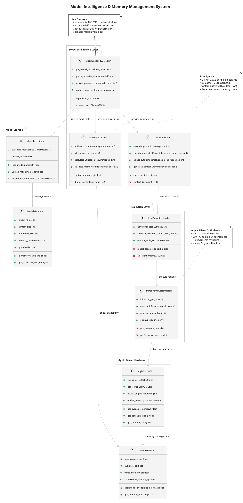
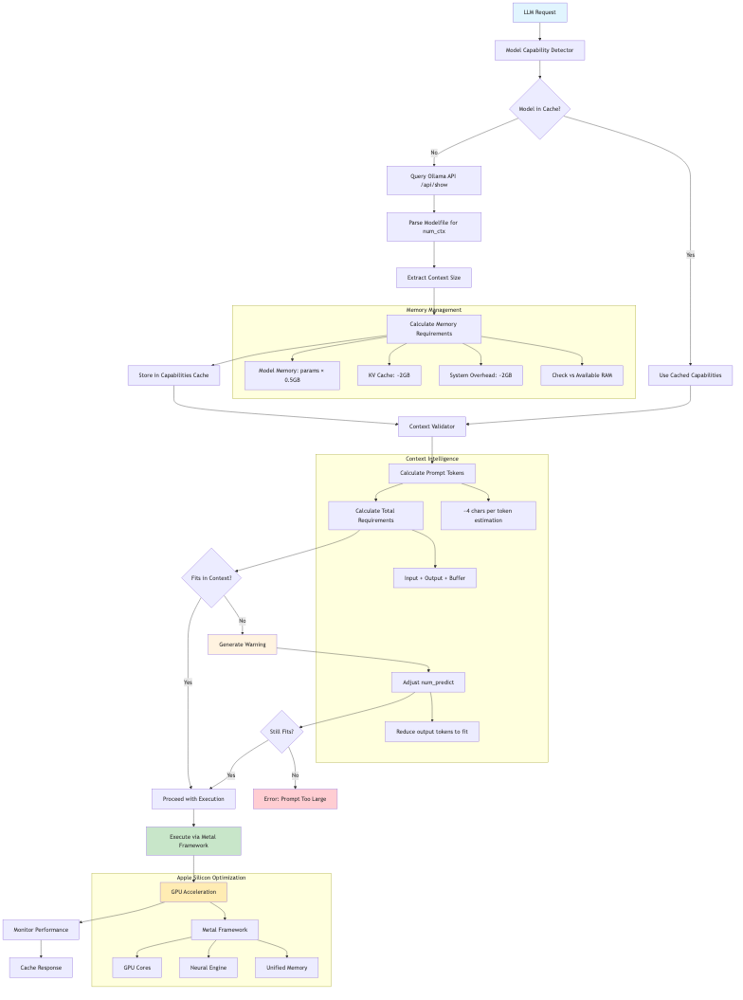
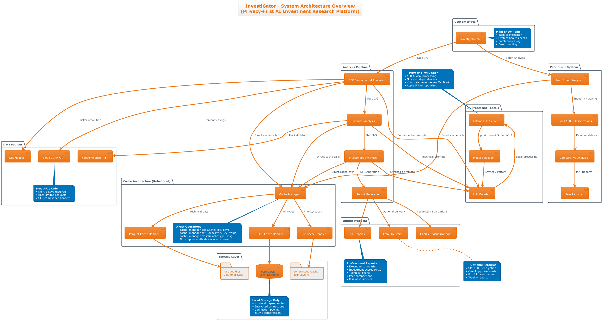
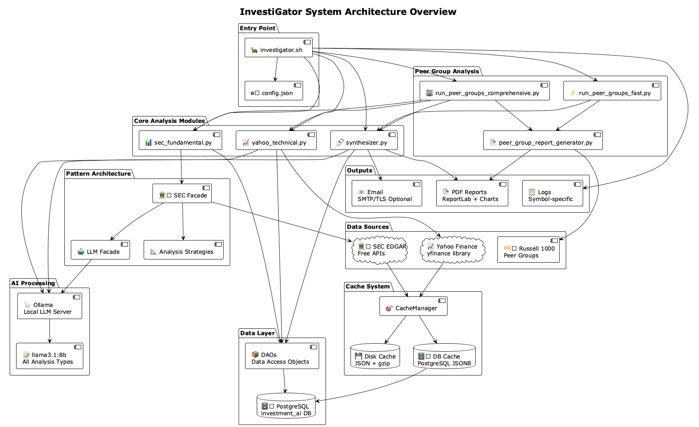
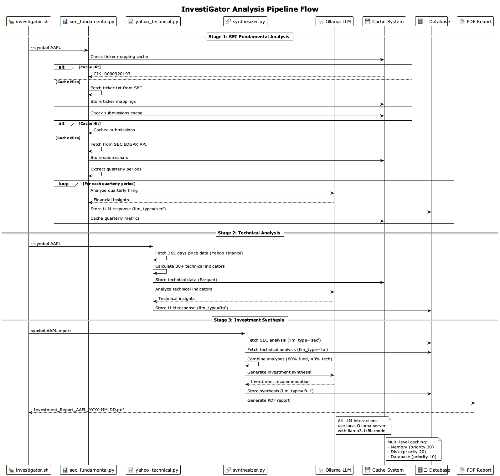
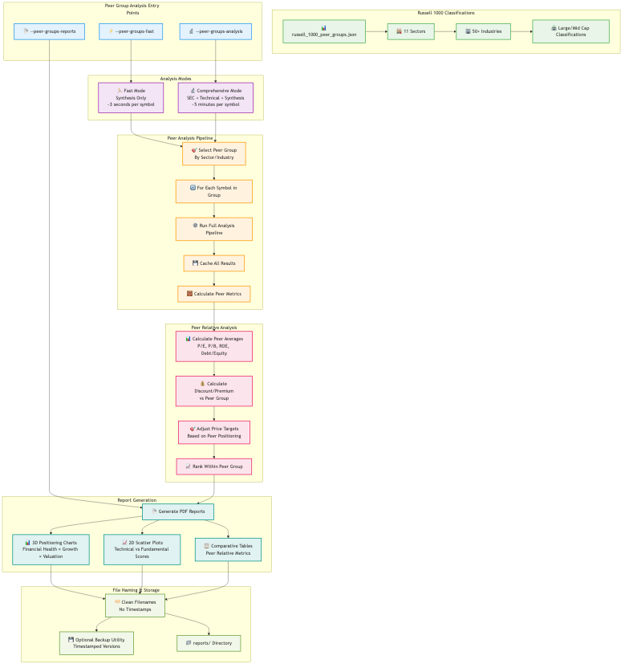
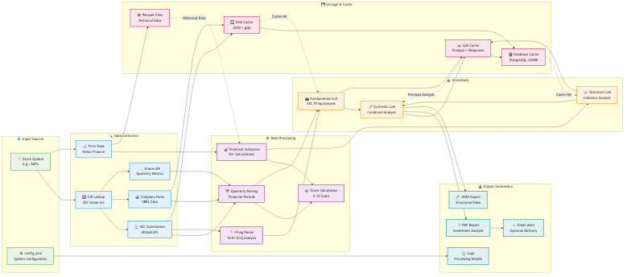

// Architecture documentation for InvestiGator
// This file is included in the main README.adoc

[[architecture]]
== 🏗️ System Architecture

[source,text]
----
    ╔═══════════════════════════════════════════════════════════════════════════╗
    ║                        🏗️  System Architecture  🏗️                        ║
    ╠═══════════════════════════════════════════════════════════════════════════╣
    ║                                                                           ║
    ║  📋 Pattern-Based Design             🎯 Enterprise-Grade Architecture     ║
    ║  ├─ Facades & Strategies             ├─ Separation of Concerns           ║
    ║  ├─ Observer Patterns                ├─ Testable Components              ║
    ║  ├─ Factory Methods                  ├─ Modular Design                   ║
    ║  └─ Command Pattern                  └─ Extensible Framework             ║
    ║                                                                           ║
    ║  🔄 Three-Stage Pipeline             💾 Multi-Level Caching              ║
    ║  ├─ SEC Analysis (Fundamental)       ├─ File Cache (Priority: 20)        ║
    ║  ├─ Technical Analysis (Charts)      ├─ Parquet Cache (Priority: 15)     ║
    ║  └─ AI Synthesis (Reports)           └─ Database Cache (Priority: 10)    ║
    ║                                                                           ║
    ║  🤖 Enhanced AI Intelligence         🍎 Apple Silicon Optimization        ║
    ║  ├─ Dynamic Context Detection        ├─ Metal Framework GPU Acceleration  ║
    ║  ├─ Memory Intelligence              ├─ Unified Memory Architecture       ║
    ║  ├─ Context Validation               ├─ Neural Engine Integration         ║
    ║  └─ Performance Monitoring           └─ 95%+ CPU Idle During Inference    ║
    ║                                                                           ║
    ╚═══════════════════════════════════════════════════════════════════════════╝
----

InvestiGator implements a sophisticated pattern-based architecture with comprehensive peer group analysis capabilities and enhanced AI model intelligence.

=== Enhanced LLM Architecture

The enhanced LLM architecture showcases InvestiGator's intelligent model management:

* **Dynamic Model Detection**: Automatically detects context windows (4K-128K+) from Ollama API
* **Memory Intelligence**: Real-time calculation of model memory requirements vs system availability
* **Apple Silicon Optimization**: Leverages Metal framework for GPU acceleration with 95%+ CPU idle
* **Context Validation**: Smart prompt sizing with overflow prevention

=== Model Intelligence System

The model intelligence system provides comprehensive capability management:

* **ModelCapabilityDetector**: Parses model configurations and caches capabilities
* **MemoryEstimator**: Calculates Q4_K quantization requirements (~0.5GB per billion parameters)
* **ContextValidator**: Validates prompt size and adjusts output tokens automatically
* **MetalFrameworkInterface**: Interfaces with Apple's GPU acceleration framework

=== Context Management Flow

The context management flow ensures optimal model performance:

1. **Capability Detection**: Query Ollama API and parse model configurations
2. **Memory Validation**: Check system memory against model requirements
3. **Context Sizing**: Calculate prompt tokens and validate against model limits
4. **Execution**: Use Metal framework for GPU-accelerated inference
5. **Monitoring**: Track performance and cache results

=== Core Components

[cols="3,4,3", options="header"]
|===
| Component | Description | Key Features

| *Entry Point*
| `investigator.sh` - Bash orchestrator that coordinates all analysis
| CLI interface, system checks, error handling

| *Core Analysis Modules*
| Three main analysis engines for comprehensive investment research
| SEC fundamental, Technical analysis, AI synthesis

| *Peer Group Analysis*
| Advanced peer comparison with Russell 1000 classifications  
| Relative valuations, discount/premium analysis, adjusted price targets

| *Pattern Architecture*
| Facades, strategies, and observer patterns for extensibility
| Modular design, separation of concerns, testable components

| *Cache System*
| Multi-level caching with intelligent prioritization
| Disk + database backends, compression, observability

| *AI Integration*
| Local LLM processing with Ollama integration
| Privacy-first, configurable models, structured outputs
|===

=== Architecture Overview

The system follows a layered architecture with clear separation of concerns:

.InvestiGator System Architecture Overview

.Legacy Architecture Diagram

=== Analysis Pipeline

InvestiGator executes a comprehensive three-stage analysis pipeline:

.Analysis Pipeline Flow

==== Pipeline Stages

1. **SEC Fundamental Analysis** (~2-5 minutes per stock)
   - Maps ticker to CIK using SEC ticker.txt
   - Fetches company submissions and facts from SEC EDGAR
   - Extracts quarterly metrics via XBRL Frame API
   - Generates AI analysis for each filing period

2. **Technical Analysis** (~1-2 minutes per stock)  
   - Fetches 365 days of price/volume data from Yahoo Finance
   - Calculates 30+ technical indicators
   - Identifies patterns and support/resistance levels
   - Generates AI-powered technical insights

3. **Investment Synthesis** (~30 seconds per stock)
   - Combines fundamental and technical analyses
   - Calculates weighted investment score (60% fundamental, 40% technical)
   - Generates comprehensive investment recommendation
   - Creates professional PDF reports with charts

=== Peer Group Analysis Architecture

The peer group analysis system provides institutional-quality comparative analysis:

.Peer Group Analysis Architecture

==== Peer Group Features

- **Russell 1000 Classifications**: 11 sectors, 50+ industries
- **Comprehensive Pipeline**: Full SEC + Technical + Synthesis for each symbol
- **Relative Valuations**: P/E, P/B, ROE, debt ratios vs peer averages
- **Adjusted Price Targets**: Peer-informed valuation adjustments
- **Professional Reports**: PDF reports with 3D/2D positioning charts

=== Data Flow Architecture

The system implements intelligent data flow with caching and observability:

.Data Flow and Caching

==== Key Data Flows

- **SEC Data**: EDGAR API → Cache → AI Analysis → Storage
- **Technical Data**: Yahoo Finance → Indicators → AI Analysis → Parquet Cache  
- **AI Processing**: Local Ollama → Structured Outputs → Cache + Database
- **Report Generation**: Combined Data → PDF Reports → Optional Email Delivery