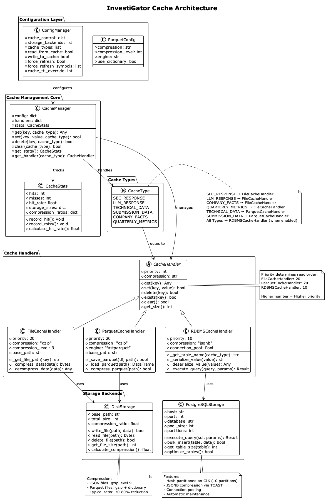
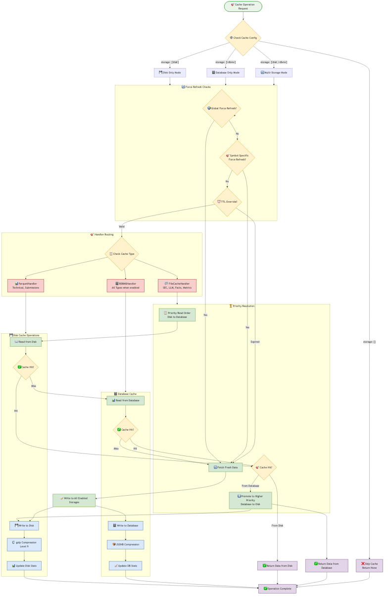

// Cache Management documentation for InvestiGator
// This file is included in the main README.adoc

[[cache-management]]
== 💾 Cache Management System

[source,text]
----
    ╔══════════════════════════════════════════════════════════════════════════╗
    ║                       💾  Cache Management  💾                           ║
    ╠══════════════════════════════════════════════════════════════════════════╣
    ║                                                                          ║
    ║  🏎️ MULTI-LEVEL ARCHITECTURE           📊 INTELLIGENT PRIORITIZATION    ║
    ║  ┌─────────────────────────────┐       ┌─────────────────────────────┐  ║
    ║  │ File Cache    │ Priority: 20│       │ Cache Hit:      85-95%      │  ║
    ║  │ Parquet Cache │ Priority: 15│       │ Compression:    70-80%      │  ║
    ║  │ RDBMS Cache   │ Priority: 10│       │ Auto-Promotion: Enabled     │  ║
    ║  └─────────────────────────────┘       └─────────────────────────────┘  ║
    ║                                                                          ║
    ║  🗂️ CACHE TYPES                        ⚡ PERFORMANCE METRICS           ║
    ║  ├─ LLM_RESPONSE                       ├─ File Access:    0.5-10ms      ║
    ║  ├─ COMPANY_FACTS                      ├─ DB Access:     50-200ms       ║
    ║  ├─ SEC_RESPONSE                       ├─ Throughput:    100+ ops/s     ║
    ║  ├─ TECHNICAL_DATA                     └─ Cache Size:    ~1GB typical   ║
    ║  ├─ SUBMISSION_DATA                                                      ║
    ║  └─ QUARTERLY_METRICS                                                    ║
    ║                                                                          ║
    ╚══════════════════════════════════════════════════════════════════════════╝
----

InvestiGator features a sophisticated multi-level caching system designed for optimal performance and flexibility.

=== Cache Architecture Overview

The cache management system supports multiple storage backends with uniform compression and intelligent prioritization.

.Cache System Architecture

=== Storage Backends

[cols="2,3,3,2", options="header"]
|===
| Backend | Format | Priority | Use Case

| **Disk Cache**
| JSON + gzip compression (level 9)
| 20
| Fast local access, development

| **Database Cache**  
| PostgreSQL JSONB with TOAST compression
| 10
| Persistent storage, production redundancy

| **Memory Cache**
| In-process Python objects
| 30  
| Ultra-fast access (currently disabled)
|===

=== Cache Configuration

Configure the cache system in `config.json`:

[source,json]
----
{
  "cache_control": {
    "storage": ["disk", "rdbms"],     // Storage backends to use
    "types": null,                   // Cache types filter (null = all)
    "read_from_cache": true,         // Enable cache reads
    "write_to_cache": true,          // Enable cache writes  
    "force_refresh": false,          // Global force refresh
    "force_refresh_symbols": null,   // Symbol-specific refresh
    "cache_ttl_override": null       // TTL override in hours
  },
  "parquet": {
    "compression": "gzip",           // Compression algorithm
    "compression_level": 9          // Maximum compression (1-9)
  }
}
----

=== Cache Types

[cols="3,4,3", options="header"]
|===
| Cache Type | Description | Handler

| **SEC_RESPONSE**
| SEC EDGAR API responses, company filings
| FileCacheHandler

| **LLM_RESPONSE**
| AI model prompts and responses with metadata
| FileCacheHandler

| **TECHNICAL_DATA**
| Price data, indicators in Parquet format
| ParquetCacheHandler

| **SUBMISSION_DATA**
| Company submission lists and metadata
| ParquetCacheHandler  

| **COMPANY_FACTS**
| XBRL company facts from SEC
| FileCacheHandler

| **QUARTERLY_METRICS**
| Extracted quarterly financial metrics
| FileCacheHandler
|===

=== Cache Flow and Operations

.Cache Operations Flow

==== Read Priority Order

1. **Memory Cache** (priority 30) - Instant access
2. **Disk Cache** (priority 20) - Fast file system access (10-50ms)
3. **Database Cache** (priority 10) - Network access (50-200ms)

==== Write Operations

All enabled storage backends receive writes simultaneously for redundancy.

=== Cache Configuration Examples

[cols="3,4,3", options="header"]
|===
| Use Case | Configuration | Description

| **Production**
| `"storage": ["disk", "rdbms"]`
| Full redundancy with both backends

| **Development**  
| `"storage": ["disk"]`
| Fast disk-only, no database dependency

| **No Cache**
| `"storage": []`
| Disable caching, always fetch fresh

| **SEC Only**
| `"storage": ["disk"], "types": ["sec_response"]`
| Cache expensive SEC calls only

| **Force Refresh**
| `"force_refresh_symbols": ["AAPL"]`
| Force refresh specific symbols

| **Testing**
| `"cache_ttl_override": 0.5`
| Short TTL for CI/CD pipelines
|===

=== Cache Management Commands

==== CLI Cache Operations

[source,bash]
----
# Cache inspection
./investigator.sh --inspect-cache           # Show all cache contents
./investigator.sh --inspect-cache --symbol AAPL  # Show cache for specific symbol
./investigator.sh --cache-sizes             # Show cache sizes and statistics

# Cache cleanup
./investigator.sh --clean-cache-all         # Clean all caches
./investigator.sh --clean-cache --symbol AAPL    # Clean cache for specific symbol
./investigator.sh --clean-cache-disk --symbol AAPL  # Clean disk cache only
./investigator.sh --clean-cache-db --symbol AAPL    # Clean database cache only

# Force refresh
./investigator.sh --force-refresh --symbol AAPL     # Force refresh specific symbol

# Testing
./investigator.sh --test-cache              # Run cache system tests
----

=== Directory Structure

[source,text]
----
InvestiGator/
├── data/                           # Main data directory
│   ├── sec_cache/                  # SEC EDGAR cache
│   │   ├── ticker_cik_map.txt      # Symbol to CIK mappings
│   │   ├── submissions/            # Company filings lists
│   │   │   └── {SYMBOL}/
│   │   │       └── {SYMBOL}_{CIK}.json.gz
│   │   └── facts/                  # XBRL company facts
│   │       └── {CIK}.json.gz
│   │
│   ├── llm_cache/                  # LLM prompts & responses
│   │   └── {SYMBOL}/
│   │       ├── llmresponse_*_full_*.json.gz    # Synthesis responses
│   │       ├── llmresponse_*_sec_*.json.gz     # SEC analysis responses
│   │       ├── llmresponse_*_ta_*.json.gz      # Technical analysis responses
│   │       ├── prompt_*.txt.gz                 # Compressed prompts
│   │       ├── response_synthesis.txt          # Latest synthesis
│   │       └── response_technical_indicators.txt
│   │
│   ├── technical_cache/            # Technical analysis data
│   │   └── {SYMBOL}/
│   │       ├── technical_data_365d.parquet.gz
│   │       ├── technical_data_365d.parquet.meta.json
│   │       └── technical_data_{SYMBOL}.csv
│   │
│   └── price_cache/                # Price history (Parquet)
│       └── {SYMBOL}.parquet
----

=== Performance Metrics

[cols="3,2,3,2", options="header"]
|===
| Operation | Disk Cache | Database Cache | Compression Ratio

| **Read (Small)**
| 10-30ms
| 50-100ms
| N/A

| **Read (Large)**
| 30-80ms  
| 100-300ms
| N/A

| **Write (JSON)**
| 20-50ms
| 80-200ms
| 70-80%

| **Write (Parquet)**
| 50-150ms
| N/A
| 60-75%

| **Storage Efficiency**
| gzip level 9
| JSONB TOAST
| 65-80%
|===

=== Cache Maintenance Best Practices

==== Development Environment
- Use disk-only caching (`"storage": ["disk"]`)
- Short TTL for testing (`"cache_ttl_override": 0.5`)
- Regular cleanup of test data

==== Production Environment
- Use both storage backends for redundancy
- Monitor cache hit rates and performance
- Schedule regular cleanup and maintenance
- Monitor disk space usage

==== Performance Optimization
- Enable selective caching for expensive operations
- Use force refresh sparingly
- Monitor compression ratios and adjust settings
- Consider cache preloading for frequently accessed symbols

=== Troubleshooting

==== Common Cache Issues

**Cache Not Working**
[source,bash]
----
# Check cache configuration
grep -A 10 "cache_control" config.json

# Test cache system
./investigator.sh --test-cache

# Inspect cache status
./investigator.sh --inspect-cache
----

**Cache Corruption**
[source,bash]
----
# Clean and rebuild cache
./investigator.sh --clean-cache-all

# Force refresh specific symbols
./investigator.sh --force-refresh --symbol AAPL
----

**Disk Space Issues**
[source,bash]
----
# Check cache sizes
./investigator.sh --cache-sizes

# Clean old cache data
./investigator.sh --clean-cache-all
----

==== Cache Statistics

Monitor cache performance using the built-in statistics:

[source,bash]
----
# View comprehensive cache statistics
python3 -c "
from utils.cache.cache_manager import CacheManager
from config import get_config

manager = CacheManager(get_config())
stats = manager.get_stats()
print(f'Cache hits: {stats[\"hits\"]}')
print(f'Cache misses: {stats[\"misses\"]}')
print(f'Hit rate: {stats[\"hit_rate\"]:.2%}')
"
----