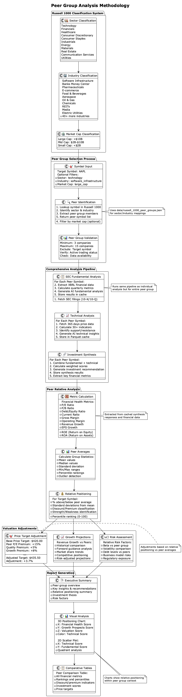

// Peer Group Analysis documentation for InvestiGator
// This file is included in the main README.adoc

[[peer-groups]]
== 🏢 Peer Group Analysis

[source,text]
----
    ╔═══════════════════════════════════════════════════════════════════════════╗
    ║                        🏢  Peer Group Analysis  🏢                        ║
    ╠═══════════════════════════════════════════════════════════════════════════╣
    ║                                                                           ║
    ║  📊 RUSSELL 1000 CLASSIFICATIONS      🎯 RELATIVE VALUATIONS             ║
    ║  ┌─────────────────────────────┐      ┌─────────────────────────────┐   ║
    ║  │ 11 Sectors                  │      │ P/E Ratios vs Peers         │   ║
    ║  │ 50+ Industries              │      │ Discount/Premium Analysis   │   ║
    ║  │ 1000+ Public Companies      │      │ Adjusted Price Targets      │   ║
    ║  │ Real-time Classifications   │      │ Risk-Adjusted Returns       │   ║
    ║  └─────────────────────────────┘      └─────────────────────────────┘   ║
    ║                                                                           ║
    ║  🔄 COMPREHENSIVE PIPELINE            📋 PROFESSIONAL REPORTS            ║
    ║  ├─ SEC Filing Analysis               ├─ 3D Positioning Charts           ║
    ║  ├─ Technical Analysis                ├─ Comparative Tables              ║
    ║  ├─ AI Synthesis                      ├─ Executive Summaries             ║
    ║  └─ Peer Comparisons                  └─ Investment Recommendations      ║
    ║                                                                           ║
    ║  💡 INVESTMENT INSIGHTS: sector_industry_SYMBOL1-SYMBOL2-SYMBOL3.pdf    ║
    ║                                                                           ║
    ╚═══════════════════════════════════════════════════════════════════════════╝
----

InvestiGator's peer group analysis provides institutional-quality comparative investment research using Russell 1000 classifications.

=== Overview

The peer group analysis system enables sophisticated comparative analysis by:

- **Industry Classification**: Using Russell 1000 sector/industry mappings
- **Comprehensive Analysis**: Running full pipeline (SEC + Technical + Synthesis) for all symbols
- **Relative Valuations**: Calculating discount/premium vs peer averages  
- **Adjusted Price Targets**: Peer-informed valuation adjustments
- **Professional Reports**: PDF reports with positioning charts and comparative tables

=== Peer Group Methodology

.Peer Group Analysis Methodology

==== Analysis Modes

[cols="2,3,3,2", options="header"]
|===
| Mode | Description | Pipeline | Use Case

| **Fast Mode**
| Synthesis-only analysis using cached data
| Synthesis only (~3 seconds)
| Quick peer comparison with existing data

| **Comprehensive Mode**  
| Full pipeline analysis with fresh data
| SEC + Technical + Synthesis (~5 minutes per symbol)
| Complete analysis with peer relative valuations
|===

=== Usage Commands

==== Fast Peer Group Analysis
[source,bash]
----
# Fast analysis for specific industry
./investigator.sh --peer-groups-fast --peer-sector healthcare --peer-industry pharmaceuticals

# Fast analysis for financial sector
./investigator.sh --peer-groups-fast --peer-sector financials --peer-industry banks_money_center

# Fast analysis for technology sector  
./investigator.sh --peer-groups-fast --peer-sector technology --peer-industry software_infrastructure
----

==== Comprehensive Peer Group Analysis
[source,bash]
----
# Comprehensive analysis with full pipeline
./investigator.sh --peer-groups-analysis --peer-sector healthcare --peer-industry pharmaceuticals

# Comprehensive analysis for all industries in sector
./investigator.sh --peer-groups-analysis --peer-sector financials

# Comprehensive analysis for default major peer groups
./investigator.sh --peer-groups-analysis
----

==== PDF Report Generation
[source,bash]
----
# Generate PDF reports from previous analysis
./investigator.sh --peer-groups-reports
----

=== Peer Group Classifications

InvestiGator uses Russell 1000 industry classifications stored in `data/russell_1000_peer_groups.json`:

==== Available Sectors

[cols="3,4,3", options="header"]
|===
| Sector | Sample Industries | Example Companies

| **Technology**
| Software Infrastructure, Cloud Computing, Semiconductors
| MSFT, ORCL, CRM, NVDA, AMD

| **Financials**  
| Banks Money Center, Asset Management, Insurance
| JPM, BAC, WFC, BLK, MS

| **Healthcare**
| Pharmaceuticals, Biotechnology, Medical Devices
| JNJ, PFE, ABBV, AMGN, TMO

| **Consumer Discretionary**
| E-commerce, Automotive, Retail
| AMZN, EBAY, ETSY, TSLA, HD

| **Consumer Staples**
| Food & Beverages, Household Products
| PG, KO, PEP, WMT, COST

| **Industrials**
| Aerospace, Transportation, Manufacturing
| BA, CAT, GE, UNP, LMT

| **Energy**
| Oil & Gas, Renewable Energy, Utilities
| XOM, CVX, COP, NEE, DUK

| **Materials**
| Chemicals, Metals & Mining, Construction
| LIN, APD, FCX, NEM, SHW

| **Real Estate**
| REITs, Real Estate Services
| AMT, PLD, CCI, EQIX, SPG

| **Communication Services**
| Media, Telecommunications, Social Media
| META, GOOGL, NFLX, DIS, VZ

| **Utilities**
| Electric, Gas, Water Utilities
| NEE, SO, DUK, AEP, EXC
|===

=== Peer Relative Analysis Features

==== Valuation Metrics Comparison

The system calculates peer relative positioning for key metrics:

- **P/E Ratio**: Price-to-earnings vs peer average
- **P/B Ratio**: Price-to-book vs peer average  
- **Debt/Equity**: Leverage vs peer average
- **ROE**: Return on equity vs peer average
- **ROA**: Return on assets vs peer average
- **Growth Metrics**: Revenue and EPS growth vs peers

==== Discount/Premium Analysis

[source,text]
----
Example: Technology Sector Peer Analysis

| Symbol | P/E vs Peers | P/B vs Peers | Debt/Equity vs Peers | Status    |
|--------|-------------|-------------|---------------------|-----------|
| MSFT   | +15.2%      | +8.1%       | -12.3%             | Premium   |
| ORCL   | -5.8%       | +2.4%       | +18.7%             | Fair      |
| CRM    | +22.1%      | +15.6%      | -8.9%              | Premium   |
----

==== Adjusted Price Targets

The system calculates peer-adjusted price targets based on relative positioning:

[source,text]
----
Example: Peer-Adjusted Price Targets

| Symbol | Original Target | Adjusted Target | Adjustment | Reasoning                     |
|--------|----------------|----------------|------------|-------------------------------|
| MSFT   | $420.00        | $435.50        | +3.7%      | Premium justified by quality  |
| ORCL   | $145.00        | $138.25        | -4.7%      | Discount to peer average      |
| CRM    | $285.00        | $295.75        | +3.8%      | Growth premium vs peers       |
----

=== Report Features

==== PDF Report Sections

1. **Executive Summary**: Sector outlook and key insights
2. **Peer Group Overview**: Industry classification and competitive landscape  
3. **2D/3D Positioning Charts**: Visual peer group positioning
4. **Peer Relative Valuation Analysis**: Comprehensive comparison tables
5. **Individual Symbol Analysis**: Detailed recommendations for each company
6. **Adjusted Price Targets**: Peer-informed valuation adjustments

==== Chart Features

- **3D Positioning**: Financial health × Growth prospects × Valuation metrics
- **2D Scatter Plot**: Technical vs fundamental scores with quadrant analysis
- **Color Coding**: Green (strong), Yellow (average), Red (weak) positioning

=== File Naming Convention

The system generates clean, consistent filenames without timestamps:

[source,text]
----
# PDF Reports
peer_group_healthcare_pharmaceuticals_JNJ-PFE-ABBV.pdf
peer_group_technology_softwareinfrastructure_MSFT-ORCL-CRM.pdf
peer_group_financials_banksmoneycenter_JPM-BAC-WFC.pdf

# JSON/Markdown Reports  
healthcare_pharmaceuticals_JNJ-PFE-ABBV_comprehensive.json
healthcare_pharmaceuticals_JNJ-PFE-ABBV_comprehensive_summary.md
healthcare_pharmaceuticals_JNJ-PFE-ABBV_fast.json
----

=== Backup Utility

For users who need historical versions, an optional backup utility is provided:

[source,bash]
----
# Create timestamped backup of current reports
python3 utils/backup_reports.py backup

# List available backups
python3 utils/backup_reports.py list  

# Restore specific backup
python3 utils/backup_reports.py restore --backup-name backup_20250603_185000
----