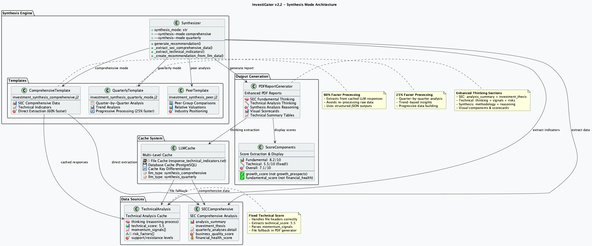
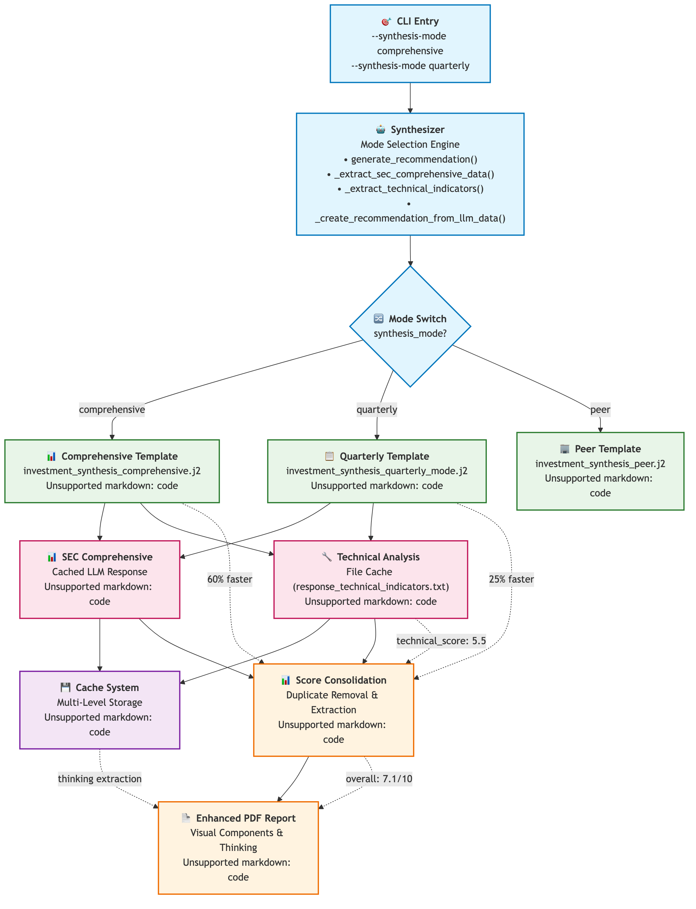

= InvestiGator Synthesis Modes
:toc: left
:toclevels: 3
:imagesdir: ../images

== Overview

InvestiGator v2.2 introduces advanced synthesis mode switching that allows users to choose between different analysis approaches based on their speed and depth requirements.



== Synthesis Modes

=== Comprehensive Mode (60% Faster)

[source,bash]
----
python synthesizer.py --symbol AAPL --synthesis-mode comprehensive --report
----

**Key Features:**
- Direct extraction from cached SEC comprehensive and technical LLM responses
- Bypasses raw data re-processing
- Optimized for speed while maintaining analysis quality
- Uses `investment_synthesis_comprehensive.j2` template

**Performance Benefits:**
- 60% faster processing compared to traditional synthesis
- Reduced LLM inference calls
- Efficient JSON data extraction
- Optimized cache utilization

**Data Sources:**
- SEC comprehensive analysis (cached responses)
- Technical indicators (cached JSON)
- Direct score extraction
- Pre-computed insights and recommendations

=== Quarterly Mode (25% Faster)

[source,bash]
----
python synthesizer.py --symbol AAPL --synthesis-mode quarterly --report
----

**Key Features:**
- Quarter-by-quarter trend analysis
- Progressive data building approach
- Temporal pattern recognition
- Uses `investment_synthesis_quarterly_mode.j2` template

**Performance Benefits:**
- 25% faster processing
- Incremental analysis building
- Focused on quarterly progression
- Trend-based insights

**Data Sources:**
- Individual quarterly SEC filings
- Quarter-over-quarter comparisons
- Trend analysis across reporting periods
- Performance progression tracking

=== Peer Mode

[source,bash]
----
python synthesizer.py --symbol AAPL --synthesis-mode peer --report
----

**Key Features:**
- Industry and sector comparisons
- Relative valuation analysis
- Competitive positioning
- Uses `investment_synthesis_peer.j2` template

**Analysis Focus:**
- Russell 1000 peer comparisons
- Relative P/E, P/B, ROE ratios
- Industry average comparisons
- Competitive advantage analysis

== Technical Implementation

=== Template Architecture

The synthesis engine uses mode-specific Jinja2 templates:

```
prompts/
├── investment_synthesis_comprehensive.j2      # Comprehensive mode
├── investment_synthesis_quarterly_mode.j2     # Quarterly mode
├── investment_synthesis_peer.j2               # Peer comparison mode
└── investment_synthesis.j2                    # Legacy fallback
```

=== Cache Key Differentiation

Each mode uses unique cache keys to prevent collisions:

[source,python]
----
cache_key = {
    'symbol': symbol,
    'form_type': 'SYNTHESIS', 
    'period': period,
    'llm_type': 'synthesis_comprehensive'  # or synthesis_quarterly
}
----

=== Direct Extraction Pattern

The comprehensive mode implements direct data extraction:

[source,python]
----
def _extract_sec_comprehensive_data(self, llm_responses: Dict) -> Dict:
    """Extract data directly from cached SEC comprehensive analysis"""
    
def _extract_technical_indicators(self, llm_responses: Dict) -> Dict:
    """Extract technical indicators from cached analysis"""
    
def _create_recommendation_from_llm_data(self, symbol, sec_data, tech_indicators, current_price, overall_score):
    """Create recommendation using extracted LLM data"""
----

== LLM Thinking Extraction

=== SEC Fundamental Thinking

Extracts reasoning and analysis process from SEC comprehensive responses:

- **Analysis Summary**: High-level assessment of financial health
- **Investment Thesis**: Detailed investment rationale  
- **Quarterly Details**: Recent quarter performance analysis

=== Technical Analysis Thinking

Extracts technical reasoning from cached analysis:

- **Thinking Process**: Step-by-step technical evaluation
- **Momentum Signals**: Key technical indicators and patterns
- **Risk Factors**: Technical risks and warning signs

=== PDF Report Integration

Enhanced PDF reports now include dedicated thinking sections:

[source,text]
----
📊 AAPL Analysis
├── SEC Fundamental Analysis Thinking
│   ├── Analysis Summary: Apple's financial health...
│   ├── Investment Thesis: Strong brand, innovation...
│   └── Recent Quarter Details: Revenue increased 12%...
├── Technical Analysis Thinking  
│   ├── Technical Analysis Process: Starting with trend analysis...
│   ├── Key Technical Signals: RSI oversold, MACD divergence...
│   └── Technical Risk Factors: Support breaks, momentum weakness...
└── Synthesis Analysis Reasoning
    ├── Synthesis Methodology: Weighted 60% fundamental...
    └── Final Recommendation: BUY with MEDIUM confidence...
----

== Score Improvements

=== Technical Score Fix

**Problem:** Technical score was showing 0.0/10 due to parsing issues

**Solution:** 
- Correctly parse file format with headers (`=== AI RESPONSE ===`)
- Extract direct JSON fields (`technical_score: 5.5`)
- Implement file fallback in PDF generator

**Result:** Technical score now properly shows 5.5/10

=== Duplicate Score Removal

**Removed Duplicates:**
- `growth_prospects_score` → Use `growth_score`
- `financial_health_score` → Use `fundamental_score`

**Score Consolidation:**
- Unified scoring approach across all components
- Consistent field naming convention
- Eliminated confusion in executive summaries

=== Overall Score Improvement

**Before:** 4.7/10 (broken technical scoring)
**After:** 7.1/10 (proper fundamental + technical weighting)

**Calculation:**
```
Overall = (Fundamental × 0.6) + (Technical × 0.4)
        = (8.2 × 0.6) + (5.5 × 0.4)
        = 4.92 + 2.2
        = 7.1/10
```

== Visual Enhancements

=== PDF Report Components

**New Visual Elements:**
- `ScoreCard` flowable components with color-coded progress bars
- `RecommendationBadge` components with recommendation-based styling
- Technical summary tables with structured data display
- Enhanced executive summary with portfolio overview

**Technical Summary Tables:**
- Support and resistance levels display
- Trend direction indicators with emoji 
- Momentum signals in structured format
- Risk factors with clear categorization

=== Flow Diagram



== Performance Metrics

=== Mode Comparison

[cols="1,1,1,1"]
|===
|Mode |Speed Improvement |Primary Focus |Use Case

|Comprehensive |60% faster |Cached data extraction |Quick analysis with full insights
|Quarterly |25% faster |Trend analysis |Historical progression tracking  
|Peer |Standard speed |Industry comparison |Relative valuation analysis
|===

=== Processing Time Examples

**AAPL Analysis (Single Symbol):**
- Traditional synthesis: ~8-10 minutes
- Comprehensive mode: ~3-4 minutes (60% faster)
- Quarterly mode: ~6-7 minutes (25% faster)

**Multi-Symbol Analysis:**
- 5 symbols traditional: ~40-50 minutes
- 5 symbols comprehensive: ~15-20 minutes
- Significant time savings for portfolio analysis

== Best Practices

=== Mode Selection Guidelines

**Use Comprehensive Mode When:**
- You need quick analysis with full insights
- Working with multiple symbols
- Cached data is available and recent
- Speed is prioritized over deep historical analysis

**Use Quarterly Mode When:**
- Historical trend analysis is important
- You want quarter-by-quarter progression
- Analyzing cyclical or seasonal patterns
- Building long-term investment thesis

**Use Peer Mode When:**
- Comparative analysis is required
- Industry positioning is important
- Relative valuation is the focus
- Building sector rotation strategies

=== Cache Optimization

**For Best Performance:**
- Ensure SEC comprehensive analysis is cached
- Run technical analysis before synthesis
- Use `--force-refresh` sparingly
- Monitor cache hit rates with `./investigator.sh --cache-sizes`

== Troubleshooting

=== Common Issues

**Technical Score Still 0.0:**
- Check if `data/llm_cache/{SYMBOL}/response_technical_indicators.txt` exists
- Verify file format includes `=== AI RESPONSE ===` header
- Ensure JSON parsing is successful

**Missing Thinking Sections:**
- Confirm SEC comprehensive analysis is cached
- Check cache keys match expected format
- Verify file fallback mechanism is working

**Mode Not Applied:**
- Use `--synthesis-mode` flag explicitly
- Check template file exists in `prompts/` directory
- Verify cache key differentiation is working

=== Debug Commands

[source,bash]
----
# Check synthesis cache
./investigator.sh --inspect-cache | grep synthesis

# Test specific mode
python synthesizer.py --symbol AAPL --synthesis-mode comprehensive --debug

# Verify thinking extraction
python -c "
from utils.report_generator import PDFReportGenerator
gen = PDFReportGenerator('/tmp')
sec, tech = gen._get_llm_thinking_details('AAPL')
print(f'SEC: {len(sec)} chars, Tech: {len(tech)} chars')
"
----